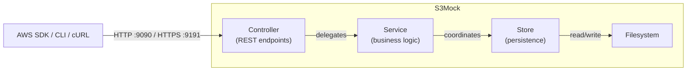

[](https://search.maven.org/#search%7Cga%7C1%7Cg%3Acom.adobe.testing%20a%3As3mock)

[](https://hub.docker.com/r/adobe/s3mock/)
[](https://hub.docker.com/r/adobe/s3mock)
[](#build--run)
[](#build--run)
[](https://bestpractices.coreinfrastructure.org/projects/7673)
[](https://api.securityscorecards.dev/projects/github.com/adobe/S3Mock)
[](https://github.com/adobe/S3Mock/stargazers/)

<!-- TOC -->
  * [S3Mock](#s3mock)
  * [Quick Start](#quick-start)
  * [Changelog](#changelog)
  * [Version Compatibility](#version-compatibility)
  * [Migration Guides](#migration-guides)
    * [4.x to 5.x (Current)](#4x-to-5x-current)
    * [3.x to 4.x](#3x-to-4x)
  * [Supported S3 Operations](#supported-s3-operations)
  * [Usage](#usage)
    * [Docker (Recommended)](#docker-recommended)
    * [Testcontainers](#testcontainers)
    * [JUnit 5 Extension](#junit-5-extension)
    * [TestNG Listener](#testng-listener)
    * [AWS CLI](#aws-cli)
    * [cURL](#curl)
  * [Configuration](#configuration)
  * [Important Limitations](#important-limitations)
  * [Troubleshooting](#troubleshooting)
  * [File System Structure](#file-system-structure)
  * [Performance & Resources](#performance--resources)
  * [Architecture & Development](#architecture--development)
  * [Build & Run](#build--run)
  * [Contributing](#contributing)
  * [License](#license)
<!-- TOC -->

## S3Mock

S3Mock is a lightweight server implementing parts of the [Amazon S3 API](https://docs.aws.amazon.com/AmazonS3/latest/API/Welcome.html) for local integration testing. It eliminates the need for actual AWS infrastructure during development and testing.

**Recommended usage**: Run S3Mock as a Docker container or with Testcontainers to avoid classpath conflicts.

## Quick Start

Get up and running in 30 seconds:

```shell
# 1. Start S3Mock
docker run -p 9090:9090 adobe/s3mock

# 2. Create a bucket
aws s3api create-bucket --bucket my-bucket --endpoint-url http://localhost:9090

# 3. Upload a file
aws s3api put-object --bucket my-bucket --key my-file --body ./my-file --endpoint-url http://localhost:9090

# 4. Download the file
aws s3api get-object --bucket my-bucket --key my-file --endpoint-url http://localhost:9090 output-file
```

For programmatic testing, see [Testcontainers](#testcontainers) or [JUnit 5 Extension](#junit-5-extension) below.

## Changelog

- [GitHub Releases](https://github.com/adobe/S3Mock/releases)
- [Detailed Changelog](CHANGELOG.md)

## Version Compatibility

| S3Mock | Status      | Spring Boot | Kotlin  | Java (target) | Java (compile) | AWS SDK v2 | Testcontainers |
|--------|-------------|-------------|---------|---------------|----------------|------------|----------------|
| 5.x    | **Active**  | 4.0.x       | 2.3     | 17            | 25             | 2.x        | 2.x            |
| 4.x    | Deprecated  | 3.x         | 2.1-2.2 | 17            | 17             | 2.x        | 1.x            |
| 3.x    | Deprecated  | 2.x         | 1.x-2.0 | 17            | 17             | 2.x        | 1.x            |
| 2.x    | End of Life | 2.x         | -       | 11            | 11             | 1.x/2.x    | -              |

## Migration Guides

### 4.x to 5.x (Current)
- **Jackson 3**: XML annotations updated to Jackson 3 (`tools.jackson` packages)
- **AWS SDK v1 removed**: All v1 client support has been dropped
- **JUnit 4 removed**: The `s3mock-junit4` module no longer exists
- **Controller package moved**: `com.adobe.testing.s3mock` to `com.adobe.testing.s3mock.controller`
- **Legacy properties removed**: Old-style configuration properties have been removed
- **Apache Commons removed**: `commons-compress`, `commons-codec`, `commons-lang3` replaced by Kotlin/Java stdlib
- **Owner DisplayName removed**: AWS APIs stopped returning `DisplayName` - this is a file system breaking change for existing data

### 3.x to 4.x
- **Tomcat replaces Jetty**: Application container changed from Jetty to Tomcat
- **Versioning API**: Basic support for S3 versioning added
- **If-(Un)modified-Since**: Conditional request handling implemented

For full details, see the [Changelog](CHANGELOG.md).

## Supported S3 Operations

See the [complete operations table](https://docs.aws.amazon.com/AmazonS3/latest/API/API_Operations_Amazon_Simple_Storage_Service.html) in AWS documentation.

<details>
<summary><b>Click to expand operations table</b> (operations marked :white_check_mark: are supported)</summary>

| Operation                                                                                                                                           | Support            | Comment                |
|-----------------------------------------------------------------------------------------------------------------------------------------------------|--------------------|------------------------|
| [AbortMultipartUpload](https://docs.aws.amazon.com/AmazonS3/latest/API/API_AbortMultipartUpload.html)                                               | :white_check_mark: |                        |
| [CompleteMultipartUpload](https://docs.aws.amazon.com/AmazonS3/latest/API/API_CompleteMultipartUpload.html)                                         | :white_check_mark: |                        |
| [CopyObject](https://docs.aws.amazon.com/AmazonS3/latest/API/API_CopyObject.html)                                                                   | :white_check_mark: |                        |
| [CreateBucket](https://docs.aws.amazon.com/AmazonS3/latest/API/API_CreateBucket.html)                                                               | :white_check_mark: |                        |
| [CreateMultipartUpload](https://docs.aws.amazon.com/AmazonS3/latest/API/API_CreateMultipartUpload.html)                                             | :white_check_mark: |                        |
| [DeleteBucket](https://docs.aws.amazon.com/AmazonS3/latest/API/API_DeleteBucket.html)                                                               | :white_check_mark: |                        |
| [DeleteBucketAnalyticsConfiguration](https://docs.aws.amazon.com/AmazonS3/latest/API/API_DeleteBucketAnalyticsConfiguration.html)                   | :x:                |                        |
| [DeleteBucketCors](https://docs.aws.amazon.com/AmazonS3/latest/API/API_DeleteBucketCors.html)                                                       | :x:                |                        |
| [DeleteBucketEncryption](https://docs.aws.amazon.com/AmazonS3/latest/API/API_DeleteBucketEncryption.html)                                           | :x:                |                        |
| [DeleteBucketIntelligentTieringConfiguration](https://docs.aws.amazon.com/AmazonS3/latest/API/API_DeleteBucketIntelligentTieringConfiguration.html) | :x:                |                        |
| [DeleteBucketInventoryConfiguration](https://docs.aws.amazon.com/AmazonS3/latest/API/API_DeleteBucketInventoryConfiguration.html)                   | :x:                |                        |
| [DeleteBucketLifecycle](https://docs.aws.amazon.com/AmazonS3/latest/API/API_DeleteBucketLifecycle.html)                                             | :white_check_mark: |                        |
| [DeleteBucketMetricsConfiguration](https://docs.aws.amazon.com/AmazonS3/latest/API/API_DeleteBucketMetricsConfiguration.html)                       | :x:                |                        |
| [DeleteBucketOwnershipControls](https://docs.aws.amazon.com/AmazonS3/latest/API/API_DeleteBucketOwnershipControls.html)                             | :x:                |                        |
| [DeleteBucketPolicy](https://docs.aws.amazon.com/AmazonS3/latest/API/API_DeleteBucketPolicy.html)                                                   | :x:                |                        |
| [DeleteBucketReplication](https://docs.aws.amazon.com/AmazonS3/latest/API/API_DeleteBucketReplication.html)                                         | :x:                |                        |
| [DeleteBucketTagging](https://docs.aws.amazon.com/AmazonS3/latest/API/API_DeleteBucketTagging.html)                                                 | :x:                |                        |
| [DeleteBucketWebsite](https://docs.aws.amazon.com/AmazonS3/latest/API/API_DeleteBucketWebsite.html)                                                 | :x:                |                        |
| [DeleteObject](https://docs.aws.amazon.com/AmazonS3/latest/API/API_DeleteObject.html)                                                               | :white_check_mark: |                        |
| [DeleteObjects](https://docs.aws.amazon.com/AmazonS3/latest/API/API_DeleteObjects.html)                                                             | :white_check_mark: |                        |
| [DeleteObjectTagging](https://docs.aws.amazon.com/AmazonS3/latest/API/API_DeleteObjectTagging.html)                                                 | :white_check_mark: |                        |
| [DeletePublicAccessBlock](https://docs.aws.amazon.com/AmazonS3/latest/API/API_DeletePublicAccessBlock.html)                                         | :x:                |                        |
| [GetBucketAccelerateConfiguration](https://docs.aws.amazon.com/AmazonS3/latest/API/API_GetBucketAccelerateConfiguration.html)                       | :x:                |                        |
| [GetBucketAcl](https://docs.aws.amazon.com/AmazonS3/latest/API/API_GetBucketAcl.html)                                                               | :x:                |                        |
| [GetBucketAnalyticsConfiguration](https://docs.aws.amazon.com/AmazonS3/latest/API/API_GetBucketAnalyticsConfiguration.html)                         | :x:                |                        |
| [GetBucketCors](https://docs.aws.amazon.com/AmazonS3/latest/API/API_GetBucketCors.html)                                                             | :x:                |                        |
| [GetBucketEncryption](https://docs.aws.amazon.com/AmazonS3/latest/API/API_GetBucketEncryption.html)                                                 | :x:                |                        |
| [GetBucketIntelligentTieringConfiguration](https://docs.aws.amazon.com/AmazonS3/latest/API/API_GetBucketIntelligentTieringConfiguration.html)       | :x:                |                        |
| [GetBucketInventoryConfiguration](https://docs.aws.amazon.com/AmazonS3/latest/API/API_GetBucketInventoryConfiguration.html)                         | :x:                |                        |
| [GetBucketLifecycle](https://docs.aws.amazon.com/AmazonS3/latest/API/API_GetBucketLifecycle.html)                                                   | :x:                | Deprecated in S3 API   |
| [GetBucketLifecycleConfiguration](https://docs.aws.amazon.com/AmazonS3/latest/API/API_GetBucketLifecycleConfiguration.html)                         | :white_check_mark: |                        |
| [GetBucketLocation](https://docs.aws.amazon.com/AmazonS3/latest/API/API_GetBucketLocation.html)                                                     | :white_check_mark: |                        |
| [GetBucketLogging](https://docs.aws.amazon.com/AmazonS3/latest/API/API_GetBucketLogging.html)                                                       | :x:                |                        |
| [GetBucketMetricsConfiguration](https://docs.aws.amazon.com/AmazonS3/latest/API/API_GetBucketMetricsConfiguration.html)                             | :x:                |                        |
| [GetBucketNotification](https://docs.aws.amazon.com/AmazonS3/latest/API/API_GetBucketNotification.html)                                             | :x:                |                        |
| [GetBucketNotificationConfiguration](https://docs.aws.amazon.com/AmazonS3/latest/API/API_GetBucketNotificationConfiguration.html)                   | :x:                |                        |
| [GetBucketOwnershipControls](https://docs.aws.amazon.com/AmazonS3/latest/API/API_GetBucketOwnershipControls.html)                                   | :x:                |                        |
| [GetBucketPolicy](https://docs.aws.amazon.com/AmazonS3/latest/API/API_GetBucketPolicy.html)                                                         | :x:                |                        |
| [GetBucketPolicyStatus](https://docs.aws.amazon.com/AmazonS3/latest/API/API_GetBucketPolicyStatus.html)                                             | :x:                |                        |
| [GetBucketReplication](https://docs.aws.amazon.com/AmazonS3/latest/API/API_GetBucketReplication.html)                                               | :x:                |                        |
| [GetBucketRequestPayment](https://docs.aws.amazon.com/AmazonS3/latest/API/API_GetBucketRequestPayment.html)                                         | :x:                |                        |
| [GetBucketTagging](https://docs.aws.amazon.com/AmazonS3/latest/API/API_GetBucketTagging.html)                                                       | :x:                |                        |
| [GetBucketVersioning](https://docs.aws.amazon.com/AmazonS3/latest/API/API_GetBucketVersioning.html)                                                 | :white_check_mark: |                        |
| [GetBucketWebsite](https://docs.aws.amazon.com/AmazonS3/latest/API/API_GetBucketWebsite.html)                                                       | :x:                |                        |
| [GetObject](https://docs.aws.amazon.com/AmazonS3/latest/API/API_GetObject.html)                                                                     | :white_check_mark: |                        |
| [GetObjectAcl](https://docs.aws.amazon.com/AmazonS3/latest/API/API_GetObjectAcl.html)                                                               | :white_check_mark: |                        |
| [GetObjectAttributes](https://docs.aws.amazon.com/AmazonS3/latest/API/API_GetObjectAttributes.html)                                                 | :white_check_mark: | for objects, not parts |
| [GetObjectLegalHold](https://docs.aws.amazon.com/AmazonS3/latest/API/API_GetObjectLegalHold.html)                                                   | :white_check_mark: |                        |
| [GetObjectLockConfiguration](https://docs.aws.amazon.com/AmazonS3/latest/API/API_GetObjectLockConfiguration.html)                                   | :white_check_mark: |                        |
| [GetObjectRetention](https://docs.aws.amazon.com/AmazonS3/latest/API/API_GetObjectRetention.html)                                                   | :white_check_mark: |                        |
| [GetObjectTagging](https://docs.aws.amazon.com/AmazonS3/latest/API/API_GetObjectTagging.html)                                                       | :white_check_mark: |                        |
| [GetObjectTorrent](https://docs.aws.amazon.com/AmazonS3/latest/API/API_GetObjectTorrent.html)                                                       | :x:                |                        |
| [GetPublicAccessBlock](https://docs.aws.amazon.com/AmazonS3/latest/API/API_GetPublicAccessBlock.html)                                               | :x:                |                        |
| [HeadBucket](https://docs.aws.amazon.com/AmazonS3/latest/API/API_HeadBucket.html)                                                                   | :white_check_mark: |                        |
| [HeadObject](https://docs.aws.amazon.com/AmazonS3/latest/API/API_HeadObject.html)                                                                   | :white_check_mark: |                        |
| [ListBucketAnalyticsConfigurations](https://docs.aws.amazon.com/AmazonS3/latest/API/API_ListBucketAnalyticsConfigurations.html)                     | :x:                |                        |
| [ListBucketIntelligentTieringConfigurations](https://docs.aws.amazon.com/AmazonS3/latest/API/API_ListBucketIntelligentTieringConfigurations.html)   | :x:                |                        |
| [ListBucketInventoryConfigurations](https://docs.aws.amazon.com/AmazonS3/latest/API/API_ListBucketInventoryConfigurations.html)                     | :x:                |                        |
| [ListBucketMetricsConfigurations](https://docs.aws.amazon.com/AmazonS3/latest/API/API_ListBucketMetricsConfigurations.html)                         | :x:                |                        |
| [ListBuckets](https://docs.aws.amazon.com/AmazonS3/latest/API/API_ListBuckets.html)                                                                 | :white_check_mark: |                        |
| [ListMultipartUploads](https://docs.aws.amazon.com/AmazonS3/latest/API/API_ListMultipartUploads.html)                                               | :white_check_mark: |                        |
| [ListObjects](https://docs.aws.amazon.com/AmazonS3/latest/API/API_ListObjects.html)                                                                 | :white_check_mark: | Deprecated in S3 API   |
| [ListObjectsV2](https://docs.aws.amazon.com/AmazonS3/latest/API/API_ListObjectsV2.html)                                                             | :white_check_mark: |                        |
| [ListObjectVersions](https://docs.aws.amazon.com/AmazonS3/latest/API/API_ListObjectVersions.html)                                                   | :white_check_mark: |                        |
| [ListParts](https://docs.aws.amazon.com/AmazonS3/latest/API/API_ListParts.html)                                                                     | :white_check_mark: |                        |
| [PostObject](https://docs.aws.amazon.com/AmazonS3/latest/API/RESTObjectPOST.html)                                                                   | :white_check_mark: |                        |
| [PutBucketAccelerateConfiguration](https://docs.aws.amazon.com/AmazonS3/latest/API/API_PutBucketAccelerateConfiguration.html)                       | :x:                |                        |
| [PutBucketAcl](https://docs.aws.amazon.com/AmazonS3/latest/API/API_PutBucketAcl.html)                                                               | :x:                |                        |
| [PutBucketAnalyticsConfiguration](https://docs.aws.amazon.com/AmazonS3/latest/API/API_PutBucketAnalyticsConfiguration.html)                         | :x:                |                        |
| [PutBucketCors](https://docs.aws.amazon.com/AmazonS3/latest/API/API_PutBucketCors.html)                                                             | :x:                |                        |
| [PutBucketEncryption](https://docs.aws.amazon.com/AmazonS3/latest/API/API_PutBucketEncryption.html)                                                 | :x:                |                        |
| [PutBucketIntelligentTieringConfiguration](https://docs.aws.amazon.com/AmazonS3/latest/API/API_PutBucketIntelligentTieringConfiguration.html)       | :x:                |                        |
| [PutBucketInventoryConfiguration](https://docs.aws.amazon.com/AmazonS3/latest/API/API_PutBucketInventoryConfiguration.html)                         | :x:                |                        |
| [PutBucketLifecycle](https://docs.aws.amazon.com/AmazonS3/latest/API/API_PutBucketLifecycle.html)                                                   | :x:                | Deprecated in S3 API   |
| [PutBucketLifecycleConfiguration](https://docs.aws.amazon.com/AmazonS3/latest/API/API_PutBucketLifecycleConfiguration.html)                         | :white_check_mark: |                        |
| [PutBucketLogging](https://docs.aws.amazon.com/AmazonS3/latest/API/API_PutBucketLogging.html)                                                       | :x:                |                        |
| [PutBucketMetricsConfiguration](https://docs.aws.amazon.com/AmazonS3/latest/API/API_PutBucketMetricsConfiguration.html)                             | :x:                |                        |
| [PutBucketNotification](https://docs.aws.amazon.com/AmazonS3/latest/API/API_PutBucketNotification.html)                                             | :x:                |                        |
| [PutBucketNotificationConfiguration](https://docs.aws.amazon.com/AmazonS3/latest/API/API_PutBucketNotificationConfiguration.html)                   | :x:                |                        |
| [PutBucketOwnershipControls](https://docs.aws.amazon.com/AmazonS3/latest/API/API_PutBucketOwnershipControls.html)                                   | :x:                |                        |
| [PutBucketPolicy](https://docs.aws.amazon.com/AmazonS3/latest/API/API_PutBucketPolicy.html)                                                         | :x:                |                        |
| [PutBucketReplication](https://docs.aws.amazon.com/AmazonS3/latest/API/API_PutBucketReplication.html)                                               | :x:                |                        |
| [PutBucketRequestPayment](https://docs.aws.amazon.com/AmazonS3/latest/API/API_PutBucketRequestPayment.html)                                         | :x:                |                        |
| [PutBucketTagging](https://docs.aws.amazon.com/AmazonS3/latest/API/API_PutBucketTagging.html)                                                       | :x:                |                        |
| [PutBucketVersioning](https://docs.aws.amazon.com/AmazonS3/latest/API/API_PutBucketVersioning.html)                                                 | :white_check_mark: |                        |
| [PutBucketWebsite](https://docs.aws.amazon.com/AmazonS3/latest/API/API_PutBucketWebsite.html)                                                       | :x:                |                        |
| [PutObject](https://docs.aws.amazon.com/AmazonS3/latest/API/API_PutObject.html)                                                                     | :white_check_mark: |                        |
| [PutObjectAcl](https://docs.aws.amazon.com/AmazonS3/latest/API/API_PutObjectAcl.html)                                                               | :white_check_mark: |                        |
| [PutObjectLegalHold](https://docs.aws.amazon.com/AmazonS3/latest/API/API_PutObjectLegalHold.html)                                                   | :white_check_mark: |                        |
| [PutObjectLockConfiguration](https://docs.aws.amazon.com/AmazonS3/latest/API/API_PutObjectLockConfiguration.html)                                   | :white_check_mark: |                        |
| [PutObjectRetention](https://docs.aws.amazon.com/AmazonS3/latest/API/API_PutObjectRetention.html)                                                   | :white_check_mark: |                        |
| [PutObjectTagging](https://docs.aws.amazon.com/AmazonS3/latest/API/API_PutObjectTagging.html)                                                       | :white_check_mark: |                        |
| [PutPublicAccessBlock](https://docs.aws.amazon.com/AmazonS3/latest/API/API_PutPublicAccessBlock.html)                                               | :x:                |                        |
| [RestoreObject](https://docs.aws.amazon.com/AmazonS3/latest/API/API_RestoreObject.html)                                                             | :x:                |                        |
| [SelectObjectContent](https://docs.aws.amazon.com/AmazonS3/latest/API/API_SelectObjectContent.html)                                                 | :x:                |                        |
| [UploadPart](https://docs.aws.amazon.com/AmazonS3/latest/API/API_UploadPart.html)                                                                   | :white_check_mark: |                        |
| [UploadPartCopy](https://docs.aws.amazon.com/AmazonS3/latest/API/API_UploadPartCopy.html)                                                           | :white_check_mark: |                        |
| [WriteGetObjectResponse](https://docs.aws.amazon.com/AmazonS3/latest/API/API_WriteGetObjectResponse.html)                                           | :x:                |                        |

</details>

## Usage

### Docker (Recommended)

The Docker image is available on [Docker Hub](https://hub.docker.com/r/adobe/s3mock) and is the recommended way to run S3Mock.

**Basic usage:**
```shell
docker run -p 9090:9090 -p 9191:9191 adobe/s3mock
```

Ports: `9090` (HTTP), `9191` (HTTPS)

**With configuration:**
```shell
docker run -p 9090:9090 -p 9191:9191 \
  -e COM_ADOBE_TESTING_S3MOCK_STORE_INITIAL_BUCKETS=test-bucket \
  -e debug=true \
  adobe/s3mock
```

**Docker Compose:**
```yaml
services:
  s3mock:
    image: adobe/s3mock:latest
    environment:
      - COM_ADOBE_TESTING_S3MOCK_STORE_INITIAL_BUCKETS=bucket1,bucket2
    ports:
      - 9090:9090
      - 9191:9191
```

**With persistent storage:**
```yaml
services:
  s3mock:
    image: adobe/s3mock:latest
    environment:
      - COM_ADOBE_TESTING_S3MOCK_STORE_ROOT=containers3root
      - COM_ADOBE_TESTING_S3MOCK_STORE_RETAIN_FILES_ON_EXIT=true
    ports:
      - 9090:9090
    volumes:
      - ./locals3root:/containers3root
```

### Testcontainers

The [`S3MockContainer`](testsupport/testcontainers/src/main/kotlin/com/adobe/testing/s3mock/testcontainers/S3MockContainer.kt) provides a pre-configured Testcontainers implementation.

**Maven dependency:**
```xml
<dependency>
  <groupId>com.adobe.testing</groupId>
  <artifactId>s3mock-testcontainers</artifactId>
  <version>...</version>
  <scope>test</scope>
</dependency>
```

**Usage example:**
```kotlin
@Testcontainers
class MyTest {
  @Container
  val s3Mock = S3MockContainer("latest")
    .withInitialBuckets("test-bucket")

  @Test
  fun test() {
    val s3Client = S3Client.builder()
      .endpointOverride(URI.create(s3Mock.httpEndpoint))
      .region(Region.US_EAST_1)
      .credentialsProvider(StaticCredentialsProvider.create(
        AwsBasicCredentials.create("foo", "bar")
      ))
      .build()

    s3Client.createBucket { it.bucket("my-bucket") }
  }
}
```

### JUnit 5 Extension

> **Note:** This module may be removed in S3Mock 6.x. Consider using [Testcontainers](#testcontainers) instead.

**Maven dependency:**
```xml
<dependency>
  <groupId>com.adobe.testing</groupId>
  <artifactId>s3mock-junit5</artifactId>
  <version>...</version>
  <scope>test</scope>
</dependency>
```

**Usage:**
```kotlin
@ExtendWith(S3MockExtension::class)
class MyTest {
  @Test
  fun test(s3Client: S3Client) {
    s3Client.createBucket { it.bucket("test-bucket") }
  }
}
```

See examples: [Declarative](testsupport/junit5/src/test/kotlin/com/adobe/testing/s3mock/junit5/sdk2/S3MockExtensionDeclarativeTest.kt) | [Programmatic](testsupport/junit5/src/test/kotlin/com/adobe/testing/s3mock/junit5/sdk2/S3MockExtensionProgrammaticTest.kt)

### TestNG Listener

> **Note:** This module may be removed in S3Mock 6.x. Consider using [Testcontainers](#testcontainers) instead.

**Maven dependency:**
```xml
<dependency>
  <groupId>com.adobe.testing</groupId>
  <artifactId>s3mock-testng</artifactId>
  <version>...</version>
  <scope>test</scope>
</dependency>
```

Configure in `testng.xml` - see [example configuration](testsupport/testng/src/test/resources/testng.xml).

### AWS CLI

Use with `--endpoint-url` and `--no-verify-ssl` (for HTTPS):

```shell
# Create bucket
aws s3api create-bucket --bucket my-bucket --endpoint-url http://localhost:9090

# Upload object
aws s3api put-object --bucket my-bucket --key my-file --body ./my-file --endpoint-url http://localhost:9090

# Download object
aws s3api get-object --bucket my-bucket --key my-file --endpoint-url http://localhost:9090 output-file

# HTTPS
aws s3api get-object --bucket my-bucket --key my-file --no-verify-ssl --endpoint-url https://localhost:9191 output-file
```

### cURL

```shell
# Create bucket
curl -X PUT http://localhost:9090/my-bucket/

# Upload object
curl -X PUT --upload-file ./my-file http://localhost:9090/my-bucket/my-file

# Download object
curl http://localhost:9090/my-bucket/my-file -O

# HTTPS (with self-signed certificate)
curl --insecure https://localhost:9191/my-bucket/my-file -O
```

## Configuration

Configure S3Mock using environment variables:

| Variable                                              | Default             | Description                                                   |
|-------------------------------------------------------|---------------------|---------------------------------------------------------------|
| `COM_ADOBE_TESTING_S3MOCK_STORE_ROOT`                 | Java temp directory | Base directory for file storage                               |
| `COM_ADOBE_TESTING_S3MOCK_STORE_REGION`               | `us-east-1`         | AWS region to mock                                            |
| `COM_ADOBE_TESTING_S3MOCK_STORE_INITIAL_BUCKETS`      | none                | Comma-separated list of buckets to create on startup          |
| `COM_ADOBE_TESTING_S3MOCK_STORE_RETAIN_FILES_ON_EXIT` | `false`             | Keep files after shutdown                                     |
| `COM_ADOBE_TESTING_S3MOCK_STORE_VALID_KMS_KEYS`       | none                | Comma-separated KMS key ARNs (validation only, no encryption) |
| `COM_ADOBE_TESTING_S3MOCK_CONTROLLER_CONTEXT_PATH`    | `""`                | Base context path for all endpoints                           |
| `debug`                                               | `false`             | Enable Spring Boot debug logging                              |
| `trace`                                               | `false`             | Enable Spring Boot trace logging                              |

## Important Limitations

- **Path-style access only**: S3Mock supports `http://localhost:9090/bucket/key`, not `http://bucket.localhost:9090/key`
- **Presigned URLs**: Accepted but not validated (expiration, signature, HTTP verb not checked)
- **Self-signed SSL**: Included certificate requires clients to trust it or ignore SSL errors
- **KMS**: Key validation only - no actual encryption performed
- **Not for production**: S3Mock is a testing tool and lacks security features required for production use

## Troubleshooting

<details>
<summary><b>Click to expand troubleshooting guide</b></summary>

**Port already in use (`Address already in use`)**
- Ports `9090` (HTTP) and `9191` (HTTPS) must be free
- Check with: `lsof -i :9090` (macOS/Linux) or `netstat -ano | findstr :9090` (Windows)
- Stop conflicting processes or map to different ports: `docker run -p 9091:9090 adobe/s3mock`

**Connection refused**
- Verify S3Mock is running: `docker ps | grep s3mock`
- Ensure you're using the correct endpoint URL (e.g., `http://localhost:9090`)
- Wait for startup to complete — check logs with `docker logs <container-id>`

**SSL certificate errors**
- S3Mock uses a self-signed certificate on the HTTPS port (9191)
- AWS CLI: Add `--no-verify-ssl` flag
- cURL: Add `--insecure` flag
- Java/Kotlin: Configure the SDK to trust the S3Mock certificate or disable SSL verification

**Docker not running (Testcontainers)**
- Testcontainers and integration tests require a running Docker daemon
- Start Docker Desktop or the Docker service before running tests
- Check with: `docker info`

**Classpath conflicts (JUnit 5 Extension / embedded mode)**
- S3Mock's embedded Spring Boot server may conflict with your application's dependencies
- **Recommended**: Use [Testcontainers](#testcontainers) or [Docker](#docker-recommended) instead to run S3Mock in isolation
- If using embedded mode, ensure compatible Spring Boot versions

**AWS SDK endpoint configuration**
- AWS SDK v2: Use `.endpointOverride(URI.create("http://localhost:9090"))`
- Credentials: Use any dummy credentials (e.g., `AwsBasicCredentials.create("foo", "bar")`)
- Region: Use any region (S3Mock defaults to `us-east-1`)

**Objects not found / wrong bucket**
- S3Mock supports **path-style access only**: `http://localhost:9090/bucket/key`
- Virtual-hosted style (`http://bucket.localhost:9090/key`) is **not supported**
- Verify your SDK client is configured for path-style access

</details>

## File System Structure

S3Mock stores data on disk with the following structure:

```
<root>/
  <bucket-name>/
    bucketMetadata.json              # Bucket metadata
    <object-uuid>/
      binaryData                     # Object content
      objectMetadata.json            # Object metadata
      <version-id>-binaryData        # Versioned object (if versioning enabled)
      <version-id>-objectMetadata.json
    multiparts/
      <upload-id>/
        multipartMetadata.json
        <part-number>.part
```

**Note:** The file system structure is an implementation detail and may change between releases. While files can be inspected during runtime, reusing persisted data across restarts is not officially supported.

## Performance & Resources

S3Mock is designed for testing, not production workloads. Keep the following in mind:

- **Disk**: All objects are stored on the local filesystem — disk usage grows with stored data
- **Memory**: Scales with concurrent multipart uploads and in-flight requests
- **CI environments**: Consider setting Docker resource limits (e.g., `--memory=512m`) to avoid contention with other services
- **Cleanup**: By default, S3Mock deletes all stored data on shutdown. Use `RETAIN_FILES_ON_EXIT=true` only when needed

## Architecture & Development



**Module Documentation:**
- [Project Overview](AGENTS.md) - Architecture, code style, DO/DON'T guardrails
- [Server Module](server/AGENTS.md) - Core implementation (Controller→Service→Store layers)
- [Integration Tests](integration-tests/AGENTS.md) - Testing with AWS SDK v2 clients
- [Test Support](testsupport/AGENTS.md) - Testcontainers, JUnit 5, TestNG integrations

## Build & Run

**Requirements**: Java 17+, Maven 3.9+, Docker (for Docker build and integration tests)

**Build:**
```shell
make install       # Full build with Docker
make skip-docker   # Skip Docker build
```

**Run from source:**
```shell
make run           # As Spring Boot application

# As Docker container
./mvnw clean package -pl server -am -DskipTests
docker run -p 9090:9090 -p 9191:9191 adobe/s3mock:latest
```

**Run integration tests:**
```shell
make integration-tests
```

**Technology:**
- Built with Kotlin 2.3.0 and Spring Boot 4.0
- Tests written in Kotlin
- Target JVM: 17

## Contributing

Contributions are welcome! See [Contributing Guide](.github/CONTRIBUTING.md).

**Governance**: Project leads make final decisions - see `developers` in [pom.xml](pom.xml).

**Security**: See [Security Policy](.github/SECURITY.md) for reporting vulnerabilities. S3Mock uses GitHub Actions for SBOM and vulnerability scanning.

## License

Licensed under the Apache License 2.0 - see [LICENSE](LICENSE).

---

[](https://jb.gg/OpenSourceSupport)

[](https://www.star-history.com/#adobe/S3Mock&Date)
