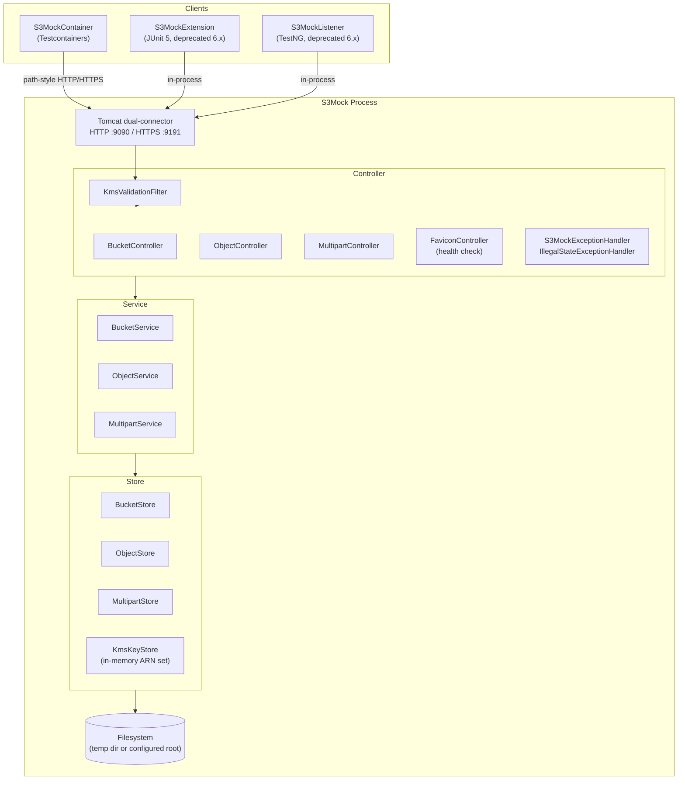

# Architecture — S3Mock

## System Overview

S3Mock is a single-process HTTP server that emulates a subset of the AWS S3 API for local integration testing. It runs as a single instance with no clustering, load balancing, or shared state.



## Data Flow

### PUT Object (representative path)

```
AWS SDK v2 Client
  │  PUT /{bucket}/{key}  (path-style)
  ▼
Tomcat  — encoded slashes decoded, backslashes allowed (S3MockConfiguration)
  ▼
KmsValidationFilter  — validates x-amz-server-side-encryption-aws-kms-key-id if present;
                       rejects unknown keys with 400 InvalidArgument
  ▼
ObjectController.putObject()  — HTTP mapping only, no logic
  ▼
ObjectService.putObject()
  — validates bucket exists (BucketStore)
  — decodes AWS chunked transfer encoding (AwsChunkedDecodingChecksumInputStream)
  — computes ETag via DigestUtil.hexDigest()
  — verifies optional client-supplied checksum
  ▼
ObjectStore.storeS3ObjectMetadata()
  — acquires per-object lock: synchronized(lockStore[uuid])
  — writes binary data  →  <root>/<bucket>/<uuid>/binaryData
  — writes metadata     →  <root>/<bucket>/<uuid>/objectMetadata.json
  — if versioning enabled: writes version file alongside existing data
  ▼
BucketStore.addKeyToBucket()
  — acquires per-bucket lock: synchronized(lockStore[bucketName])
  — updates key→UUID mapping in bucketMetadata.json
  ▼
ObjectController  — returns ETag header, 200 OK
```

### Key transformation points

| Point | What happens |
|---|---|
| `KmsValidationFilter` | KMS ARN format validation; no real encryption — see [INVARIANTS.md](../INVARIANTS.md) |
| `AwsChunkedDecoding*InputStream` | Strips AWS V4 chunked transfer signing metadata from the request body |
| `DigestUtil.hexDigest()` | MD5 ETag for single-part; `hexDigestMultipart()` uses the special S3 format `{md5_of_md5s}-{n_parts}` |
| `ObjectStore` | Splits storage: binary body → flat file, all metadata → JSON sidecar |
| `S3MockExceptionHandler` | Converts `S3Exception` constants → XML `ErrorResponse` with AWS-compatible error codes and HTTP status |
| `IllegalStateExceptionHandler` | Converts unexpected `IllegalStateException` → `500 InternalError` XML response |

## Key Components

### Controller layer (`server/controller/`)

Routing, header parsing, HTTP status codes, content negotiation. No business logic — all calls delegate immediately to services. Controllers never catch exceptions.

| Class | Responsibility |
|---|---|
| `BucketController` | Bucket CRUD, lifecycle, versioning, ACL, tagging, location |
| `ObjectController` | Object CRUD, copy, tagging, ACL, presigned URL acceptance |
| `MultipartController` | Multipart upload lifecycle: initiate, upload part, complete, abort, list |
| `FaviconController` | `GET /favicon.ico` → `200 OK`; used as the container health check endpoint |
| `S3MockExceptionHandler` | `@ControllerAdvice` — `S3Exception` → XML error response |
| `IllegalStateExceptionHandler` | `@ControllerAdvice` — unexpected errors → `500 InternalError` |
| `KmsValidationFilter` | Servlet filter — KMS ARN validation before controllers see the request |

Header converters (Spring `HttpMessageConverter`): `TaggingHeaderConverter`, `HttpRangeHeaderConverter`, `ObjectCannedAclHeaderConverter`, `ObjectOwnershipHeaderConverter`, `ChecksumModeHeaderConverter`, `RegionConverter`.

### Service layer (`server/service/`)

All business logic, validation, and orchestration. Services throw `S3Exception` constants only — no HTTP awareness.

| Class | Responsibility |
|---|---|
| `BucketService` | Bucket validation, lifecycle rules, versioning state, ACL, policy |
| `ObjectService` | Object storage, retrieval, copy, tagging, checksums, legal hold, retention |
| `MultipartService` | Multipart upload lifecycle, part tracking, ETag assembly |
| `ServiceBase` | Shared helpers (bucket/object existence checks) |

### Store layer (`server/store/`)

Filesystem persistence. Every write acquires a per-bucket (`BucketStore`) or per-object (`ObjectStore`) lock from a `ConcurrentHashMap` lock store. No cross-store transactions exist.

| Class | Responsibility |
|---|---|
| `BucketStore` | Bucket directory creation; key→UUID mapping in `bucketMetadata.json`; per-bucket `synchronized` locks |
| `ObjectStore` | Binary file + `objectMetadata.json` writes; per-object `synchronized` locks; versioning file management |
| `MultipartStore` | Part files + `multipartMetadata.json`; assembles parts into a final object on completion |
| `KmsKeyStore` | In-memory `Set<String>` of valid KMS ARNs; validated by `KmsValidationFilter` |
| `StoreCleaner` | `DisposableBean` — deletes root directory on JVM shutdown unless `retainFilesOnExit=true` |
| `S3ObjectMetadata` | `data class` serialized to/from JSON as the object metadata sidecar |
| `BucketMetadata` | `data class` serialized to/from JSON; holds bucket config and the key→UUID map |

### DTO layer (`server/dto/`)

Jackson 3 (`tools.jackson`) data classes for AWS XML request/response bodies. Element names must match the [AWS S3 API specification](https://docs.aws.amazon.com/AmazonS3/latest/API/Welcome.html) exactly. `NON_EMPTY` inclusion — null/empty fields are omitted from serialized XML.

### Utility layer (`server/util/`)

| Class | Responsibility |
|---|---|
| `DigestUtil` | MD5/checksum computation; multipart ETag special format |
| `EtagUtil` | ETag string normalization (strip/add surrounding quotes) |
| `HeaderUtil` | AWS HTTP header parsing helpers |
| `AwsHttpHeaders` / `AwsHttpParameters` | AWS header and query parameter name constants |
| `AwsChunkedDecodingChecksumInputStream` | Parses AWS V4 signed chunked transfer encoding with optional trailing checksum |
| `AwsUnsignedChunkedDecodingChecksumInputStream` | Parses unsigned chunked transfer encoding |
| `BoundedInputStream` | Limits reads to a declared content-length |

## Performance Characteristics

No performance SLAs are defined — see [INVARIANTS.md](../INVARIANTS.md). S3Mock is a local testing tool; throughput and latency are not design constraints.

Known characteristics:
- All writes to the same bucket are serialized through a per-bucket `synchronized` lock; all writes to the same object are serialized through a per-object lock
- Object metadata is read from disk on every request (no in-memory read cache after startup)
- Binary bodies are streamed from disk; they are not fully buffered in memory
- Startup time is dominated by Spring Boot context initialization (~2–5 seconds in typical CI)

## Security Architecture

S3Mock has **no security** by design — see [INVARIANTS.md](../INVARIANTS.md). It is a local testing tool only.

| Concern | Behavior |
|---|---|
| Authentication | None — all requests accepted regardless of credentials or AWS Signature V4 |
| Authorization | None — any client can read or write any bucket or object |
| Presigned URLs | Accepted; signatures are parsed but not validated |
| KMS | Key ARN format validated only; no actual encryption or key material used |
| SSL/TLS | Self-signed certificate bundled as `s3mock.jks` — clients must disable certificate validation |
| Sensitive data | Not applicable — never use S3Mock to store real credentials or PII |

## Deployment

S3Mock is intended for local development and CI only.

| Mode | Command | Notes |
|---|---|---|
| Docker (recommended) | `docker run -p 9090:9090 -p 9191:9191 adobe/s3mock` | Isolated, no classpath conflicts |
| Testcontainers | `S3MockContainer("latest")` | Docker-based, ports mapped to random host ports |
| Spring Boot (dev) | `make run` | Ports 9090 / 9191 |
| In-process JUnit 5 | `@ExtendWith(S3MockExtension::class)` | Random ports; deprecated, removed in 6.x |
| In-process TestNG | `S3MockListener` in `testng.xml` | [verify with team] port defaults; deprecated, removed in 6.x |

Storage is local filesystem. By default a temp directory is created at startup and deleted on exit. To persist across restarts: set `COM_ADOBE_TESTING_S3MOCK_STORE_ROOT` to a fixed path and `COM_ADOBE_TESTING_S3MOCK_STORE_RETAIN_FILES_ON_EXIT=true`.
